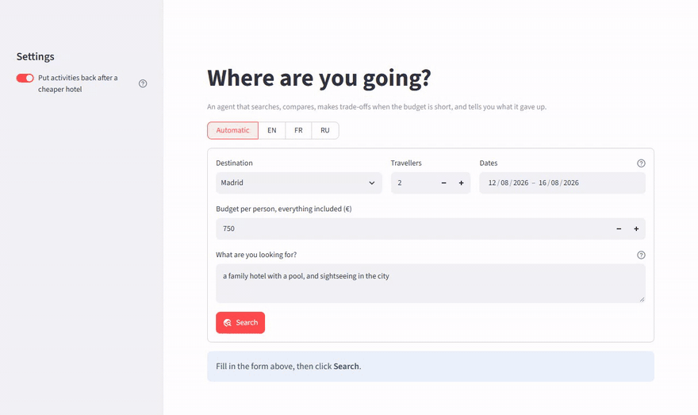

# 🧳 Travel agent

[](https://github.com/Morissala2001/travel-planning-agent/actions/workflows/tests.yml)

*An agent that plans a trip within a budget, explains every trade-off it made, and books only after you confirm. It answers in English, French or Russian.*

**[▶ Try it online](https://travel-planning-agent-morissala.streamlit.app/)** (free hosting: the first visit may take a minute to wake the app up. Online, every visitor books in their own copy of the data, deleted when they leave.)


<sub>The wish is typed in French, so the plan comes in French; then the same page in Russian.</sub>

You give a destination, dates, a budget per person and a wish in your own words ("a family hotel with a pool"). The agent searches flights and activities in a SQL database, finds the hotels whose brochures match your wish by meaning, prices the trip, and when the budget is short it gives things up one by one, tells you what it gave up, and looks at the neighbouring days in case leaving one day earlier would be better. The project has a **web app** (Streamlit), a **CLI** (`travel-agent`) and a small **library** (`src/travel_agent`).

**An agent is a loop, not a language model.** It sets a goal, calls tools, checks the result against the goal, corrects and tries again. No language model is used here: every sentence of the explanation is a template filled with numbers the code computed, so it cannot invent anything.

## Example

Barcelona, 4 nights from Aug 12, 2 travellers, €750 per person. The same request with the wish written in three languages (`travel-agent plan --city Barcelona --date 2026-08-12 --budget 750 --wish "..."`):

> **"a family hotel with a pool, and sightseeing in the city"**
> Flight W67507 from Nice on Aug 12 at 20:20 (1.7 h): €97. Hotel: Casa Bellavista, 4 nights at €144 per night. Activities: Plage de la Barceloneta, Marché de la Boqueria, Spectacle de la Fontaine magique de Montjuïc, Musée Picasso, Parc Güell, Sagrada Familia. All in, €732 per person, for a budget of €750. I removed “Dégustation de tapas dans le quartier d'El Born” (€45). I removed “Casa Batlló” (€29). By the way, leaving on Aug 10 you would keep 7 activities instead of 6, for €736.

> **"un hôtel pour la famille avec une piscine, et des visites dans la ville"**
> Vol W67507 au départ de Nice le 12 août à 20:20 (1,7 h) : 97 €. Hôtel : Casa Bellavista, 4 nuits à 144 € la nuit. […] Le tout revient à 732 € par personne, pour un budget de 750 €. J'ai retiré « Dégustation de tapas dans le quartier d'El Born » (45 €). […]

> **"семейный отель с бассейном и экскурсии по городу"**
> Рейс W67507: Ницца, 12 августа в 20:20 (1,7 ч), 97 €. Отель: Casa Bellavista, 4 ночи по 144 € за ночь. […] Итого 732 € на человека при бюджете 750 €. Убрано из программы: «Dégustation de tapas dans le quartier d'El Born» (45 €). […]

The three wishes lead to the same hotel: the sentence encoder is multilingual. The language of the answer is detected from the wish (or forced with `--lang` / the switch at the top of the web app).

## What I fixed in the reference solution

This agent started as the final exercise of a French data-science summer course, whose data it uses. I reproduced the reference solution, ran it on a grid of **2,250 requests** (15 cities × 3 wishes × 10 budgets × 5 departure days, 4 nights, 2 travellers), and fixed what the measurements showed. With fix 1 switched off, this version proposes exactly the same trip as the reference on all 2,250 requests.

| # | Problem found | Fix | Measured effect |
|---|---|---|---|
| 1 | After stepping down to a cheaper hotel, the agent kept the bare programme it had accepted for the dearer one | Put back the activities that now fit, cheapest first (setting, on by default) | On the 429 trips with a cheaper hotel: activities kept 2.1 → **6.8**, unused budget €167 → **€82** per person |
| 2 | "The same programme for less on day X" was sometimes false: that day had fewer activities or another hotel | Said only when hotel and activities are identical | 27 false tips out of 2,250 requests removed |
| 3 | Booking never took the seats from the flight, and a second click booked the same trip twice | Seats taken and booking written in one transaction; full flights and duplicates refused | Covered by tests |
| 4 | The brochures of the city were embedded again for every departure day tried | Brochures embedded once | about 1 s → **about 0.1 s** per request (CPU) |
| 5 | "Weekend flights are much more expensive" was given as advice | Removed: the data does not support it (average fare on Fridays €151 and Saturdays €152, Mondays €168, Thursdays €170) | |

The grid and the hotel-search figures below are reproduced by `uv run travel-agent benchmark`.

## Hotel search in three languages

The brochures are in French. For each of 7 kinds of hotel (family, party, romantic, luxury, quiet, design, budget), the same wish was written in French, English and Russian and searched in every city that has such a hotel: 105 searches per language. A search is right when the top hotel's presentation or reviews match the wish ([`eval/hotel_wishes.json`](eval/hotel_wishes.json)).

| Wish written in | Top hotel matches the wish | Same top hotel as the French wish |
|---|---|---|
| French | 89.5% | — |
| English | 86.7% | 83.8% |
| Russian | 90.5% | 95.2% |

## Run it

Requirements: [uv](https://docs.astral.sh/uv/) and Python 3.13. A GPU is not needed. The sentence encoder (about 470 MB) is downloaded from the Hugging Face Hub on first use.

```bash
git clone https://github.com/Morissala2001/travel-planning-agent.git
cd travel-planning-agent
uv sync --all-extras
```

```bash
uv run streamlit run app.py      # web app
uv run travel-agent cities       # destinations and dates covered
uv run travel-agent plan --city Rome --date 2026-07-22 --budget 900 --wish "a quiet hotel to rest" -v
uv run travel-agent book --city Rome --date 2026-07-22 --budget 900 --wish "a quiet hotel to rest" --name Ada
uv run travel-agent benchmark    # the measurements of this README, a few minutes on CPU
```

`-v` prints every combination the agent priced; `--no-restore` gives the original behaviour of fix 1; `book` writes nothing without `--yes`.

**Tests** (offline: a tiny generated world and a fake encoder, no download)

```bash
uv run pytest                                   # 69 tests
TRAVEL_AGENT_RUN_SLOW=1 uv run pytest -m slow   # real encoder: the original notebook's trips, to the euro
```

## How it works

1. **Three tools** (`tools.py`). Two parameterised SQL queries (`?` placeholders, no SQL injection): flights to a city on a day with enough seats left, cheapest first, and the activities of a city. The third is a semantic search: the presentation and the reviews of each brochure are embedded once with `paraphrase-multilingual-MiniLM-L12-v2`; a wish is embedded and compared by cosine similarity. The amenities list is left out because it is almost the same in every brochure and would pull all hotels together.
2. **The budget loop** (`planner.py`). First plan: cheapest flight, most relevant hotel, every activity. While it is over budget: give up the dearest *paid* activity (removing a free one saves nothing); when none is left, step down to a cheaper hotel among the three closest to the wish (fix 1 then puts activities back); when nothing is left, say so. The hotel goes last because it is what the traveller described. Every price is per person, the hotel included.
3. **Neighbouring days.** The same reasoning is replayed for ±1 and ±2 days. The agent compares the number of activities kept first and the price second (every trip ends just under the budget, so totals alone say little), and **never moves your dates**: it points out the opportunity.
4. **Booking** (`booking.py`). Without confirmation nothing is written. With it, seats and booking are written in one transaction.
5. **Languages** (`i18n.py`, `render.py`). The agent's log is data (`Note("removed_activity", {...})`), written into sentences in the traveller's language at the end. The language is detected from the wish without any extra dependency: Cyrillic letters mean Russian, otherwise common words and French accents decide.

## Limits

- **Negation.** Sentence encoders do not understand "without" well: for "a hotel without children", a family hotel still comes first in 4 of the 15 cities with the French or Russian wish (2 with the English one).
- **Untranslated data.** Hotel brochures and activity names are in French and shown as they are.
- **Simple rules, not an optimiser.** The order of sacrifices is a choice (activities before the hotel), the agent always takes the cheapest flight and only considers the three hotels closest to the wish.
- **Language detection is a heuristic.** A wish with no clear sign (a single word such as "spa") keeps the current language.
- **Fictional data**, covering departures from July 1 to August 31, 2026.

## Structure

```
├── app.py                    # Streamlit web app
├── data/
│   ├── voyages.db            # flights, activities, bookings (SQLite)
│   └── hotels/               # 135 hotel brochures (PDF)
├── eval/hotel_wishes.json    # the multilingual search evaluation
├── src/travel_agent/
│   ├── data.py               # database and brochures
│   ├── tools.py              # flights, activities, hotel search
│   ├── planner.py            # the agent's loop and neighbouring days
│   ├── booking.py            # guarded booking
│   ├── i18n.py, render.py    # three languages
│   ├── benchmark.py          # the README's measurements
│   └── cli.py                # the `travel-agent` command
└── tests/
```

## License

The code is under the [MIT](LICENSE) license. The fictional data in `data/` (flights, activities, hotel brochures) come from the course this project started from and are not covered by this license.
